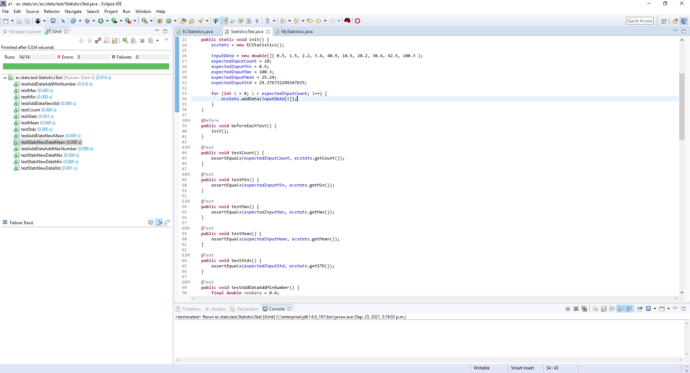

# A1 Report

Author: Mike Sadowski

Date: September 21st, 2021

Check [readme.txt](readme.txt) for lab work statement and self-evaluation.

## Q1 EC story

At my current job I work on a product called Core Share. It is a cloud storage system for any type of file a user may wish to store/backup/share to others. It also allows users and companies to easily share documents (word, power point, excel, etc) to each other and simultaneously collaborate on them. Users can also create brand new word documents using the Microsoft Online service (Word, Powerpoint, Excel) and edit them. There are also many other smaller features such as digital signatures for forms and share groups that make collaborating and sharing files within companies (or even between companies) seamless and simple. The service is provided as a Software as a Service solution (Saas), users may access the service through a browser or from a mobile application on their phone. It is used by large companies mostly, as opposed to single users for Google Drive, since most of the features are related to sharing and collaboration on the files uploaded.

The problem that this service solves is companies have many files they need to share amongst their employees. Our service allows all of the files to be in 1 convenient location (so everyone knows where to find them within the company), it allows controlled viewing of sensitive documents (permission level, for example a manager can view files a regular employee can't) and enables employees to collaborate on files as well. A lot of times there are excel spreadsheets or word documents that multiple people need to edit, instead of passing the file itself around to eachother, our service allows the simultaneous collaboration and editing on the document in real time.

An example of the data processing the service does is it scans an entire document (such as a PDF or word document) when it is uploaded, and stores the words in an ElasticSearch database. This allows the contents of documents to be searched, you can type a word into the search bar and the documents containing that word will come up in the search. This is similar to a hash table, the word is a key that corresponds to the document ID's which contain that word.

The technology platform it uses vary as there are many micro services (it is Service Oriented) involved in creating the overall service. Most of the services are written in JavaScript; Node, Sails/Express, Angular (if there is a front end component). A few are written in Java, and one is written in the .NET stack. The deployment of the services is orchestrated using Docker to build images, and the images are deployed using Kubernetes.

## Q2 Descriptive statistics project (programming)

### Q2.1 Interface design

Complete? yes

{width=90%}

### Q2.2 Implementation

Complete? yes

{width=90%}

### Q2.3 Unit test

Complete? yes

{width=90%}

### Q2.4 Main program

Complete? yes

{width=90%}

### Q2.5 Logging and documentation

Complete? yes

{width=90%}

### Q2.6 Build by ANT

Complete? yes

{width=90%}

## Q3 Java EE project on stats (programming)

### Q3.1 stats-ejb project

Complete? yes

{width=90%}

### Q3.2 stats-ejb-client project

Complete? yes

{width=90%}

Note: I tried naming the function `toString()` in the stateless session bean. However, with this name only the string: `Proxy for remote EJB StatelessEJBLocator for "/stats-ejb/StatsEJBStateless", view is interface stats.ejb.StatsEJBStatelessRemote, affinity is URI<http-remoting://localhost:8080>` was returned. After renaming it to `summaryString()`, only then did it return a correct string for me.

### Q3.3 stats-ejb-web project

Complete? yes

{width=90%}

### Q3.4 stats-ejb-web-ear project

Complete? yes

{width=90%}

**References**

1. CP630OC a1
2. https://www.tutorialspoint.com/java/java_serialization.htm
3. Course notes