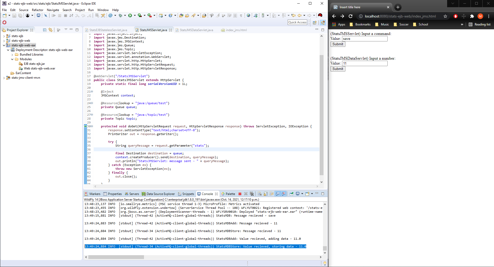
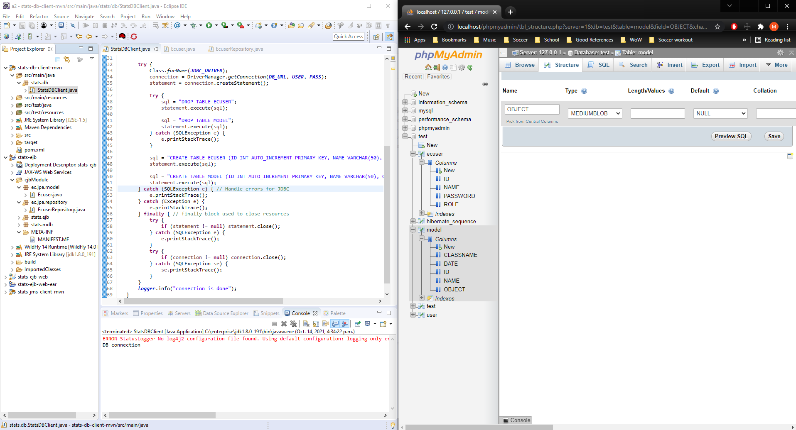
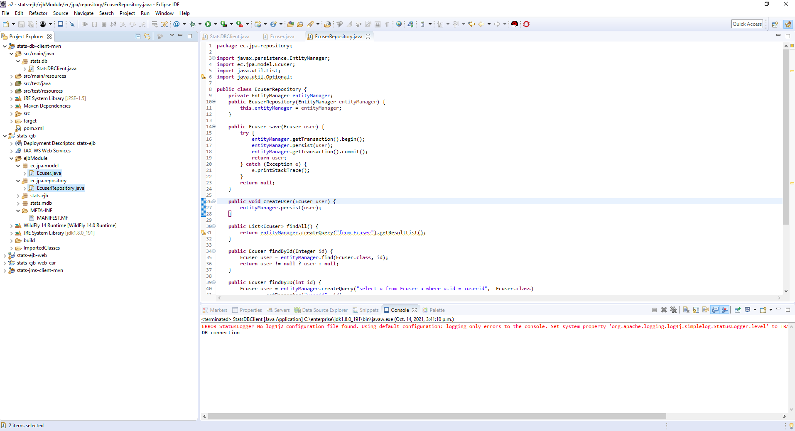
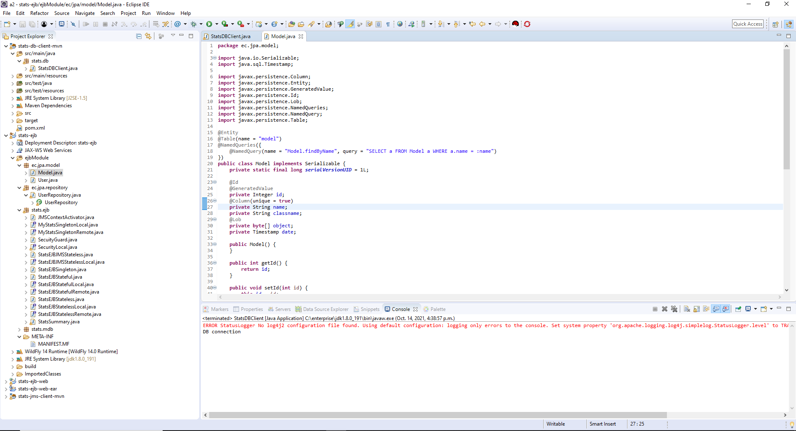
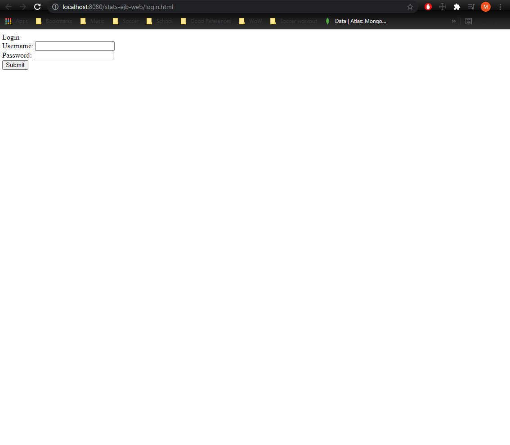
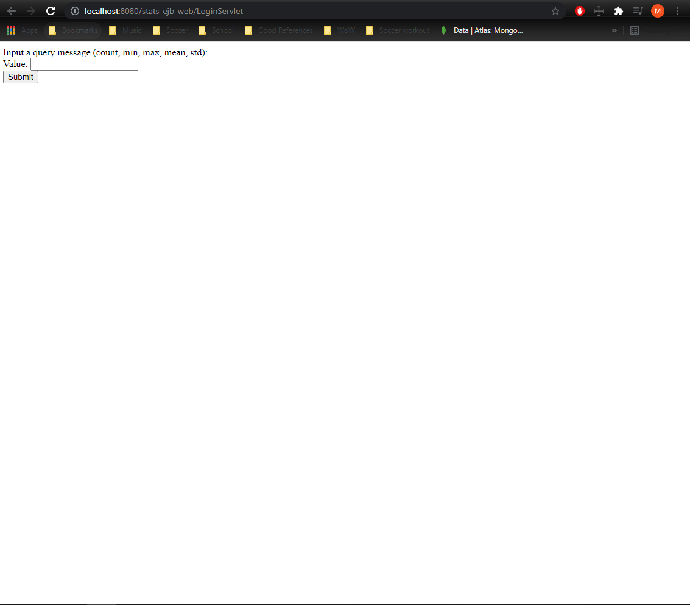

# A2 Report

Author: Mike Sadowski

Date: October 13th, 2021

Check [readme.txt](readme.txt) for lab work statement and self-evaluation.

Before running the app, make sure to run database file `stats-db-client-mvn/src/main/java/StatsDBClient.java` to make the tables and users.

`user1` is admin user (role 1), password is `password`
`user2` is developer (role 2) user, password is `password`
`user3` is admin user (role 3), password is `password`

Deploy `stats-ejb-web-ear` to WildFly 18
Open `xamp control panel`, start `Apache` and `MySql`

Make sure to switch out the `standalone-full.xml` file in WildFly (for the creation of the queues/topics for part 1)

Navigate to `http://localhost:8080/stats-ejb-web/LoginServlet`

## Q1 JMS and MDB for data collection and stats (programming)

### Q1.1 MDB for stats

Complete? yes

{width=90%}

Re-used testQueue from lab2

### Q1.2 MDB for adding and saving data

Complete? yes

{width=90%}

Re-used testTopic from lab2

### Q1.3 Standalone JMS clients

Complete? yes

{width=90%}

### Q1.4 JMS clients in Web components

Complete? yes

{width=90%}

### Q1.5 JMS clients in Session beans

Complete? yes

{width=90%}

## Q2 Data persistence with stats application (programming)

### Q2.1 Database table and client

Complete? yes

{width=90%}

### Q2.2 User entity bean

Complete? yes

{width=90%}

### Q2.3 Model entity bean

Complete? yes

{width=90%}

### Q2.4 EJB using entities

Complete? yes

{width=90%}

### Q2.5 Entity EJB Web access

Complete? yes

{width=90%}
{width=90%}
{width=90%}
{width=90%}

**References**

1. CP630OC a2
2. https://stackoverflow.com/questions/2836646/java-serializable-object-to-byte-array
3. ec-lab2-all-a2help.zip
