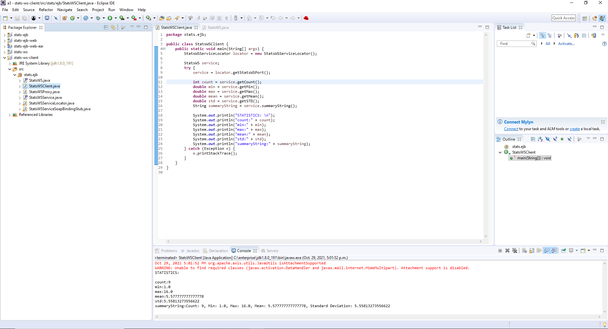
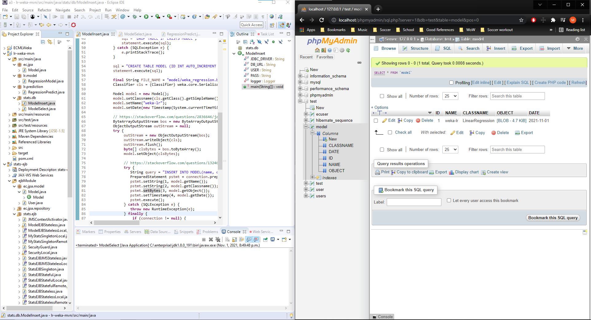
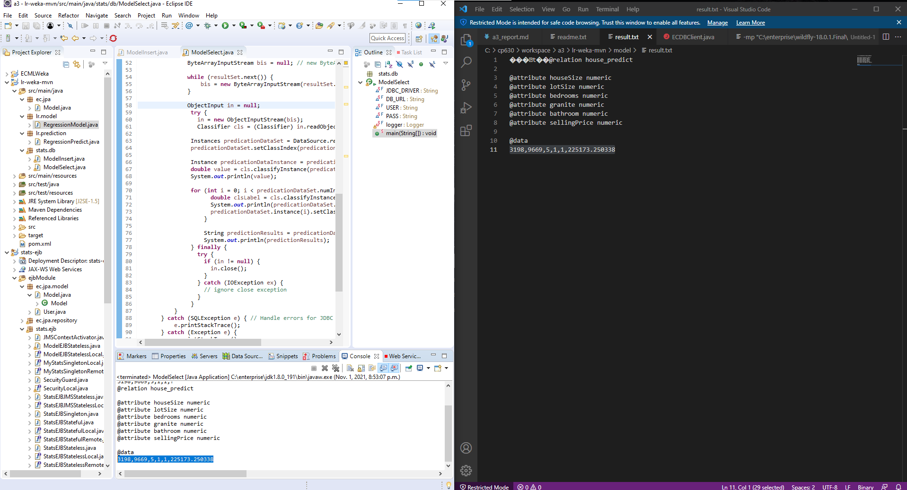

# A3 Report

Author: Mike Sadowski

Date: October 28th, 2021

Check [readme.txt](readme.txt) for lab work statement and self-evaluation.

Before starting, you must copy and paste the `data` folder from root project folder to:

`C:\enterprise\wildfly-18.0.1.Final\bin`

You should then have:
`C:\enterprise\wildfly-18.0.1.Final\bin\data\house.arff`

`C:\enterprise\wildfly-18.0.1.Final\bin\data\house_test.arff`

`C:\enterprise\wildfly-18.0.1.Final\bin\data\house_unknown.arff`

Otherwise, in question 2.3/2.4 it will fail loading the file to use against the predictions

## Q1 Web service project (programming)

### Q1.1 SOAP WS

Complete? yes

{width=90%}

### Q1.2 SOAP WS client

Complete? yes

{width=90%}

### Q1.3 RESTful Web service

Complete? yes

{width=90%}

## Q2 Linear regression for EC (programming)

### Q2.1 Weka API programming

Complete? yes

{width=90%}

### Q2.2 Model persistence

Complete? yes

{width=90%}
{width=90%}

In task 2.2 pt. 2, you can see the output of the java file in eclipes matches the `result.txt` output from the jar file.

### Q2.3 EJB component

Complete? yes

{width=90%}

### Q2.4 Web component

Complete? yes

{width=90%}

**References**

1. CP630OC a3
2. https://stackoverflow.com/questions/9620683/java-fileoutputstream-create-file-if-not-exists
3. https://stackoverflow.com/questions/1324641/cant-insert-byte-into-mysql-using-java

