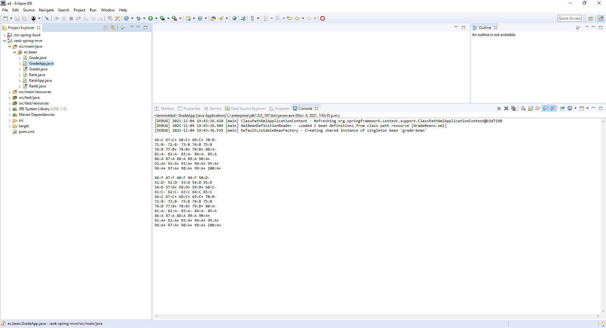
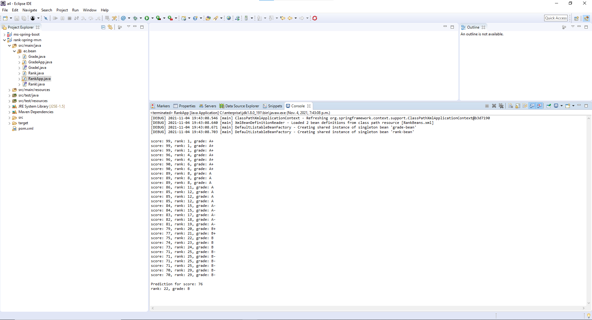
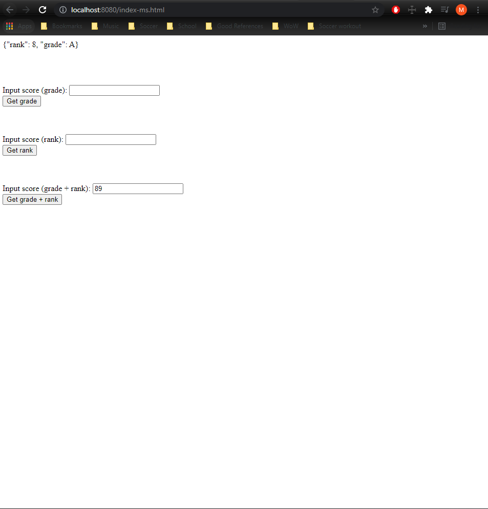
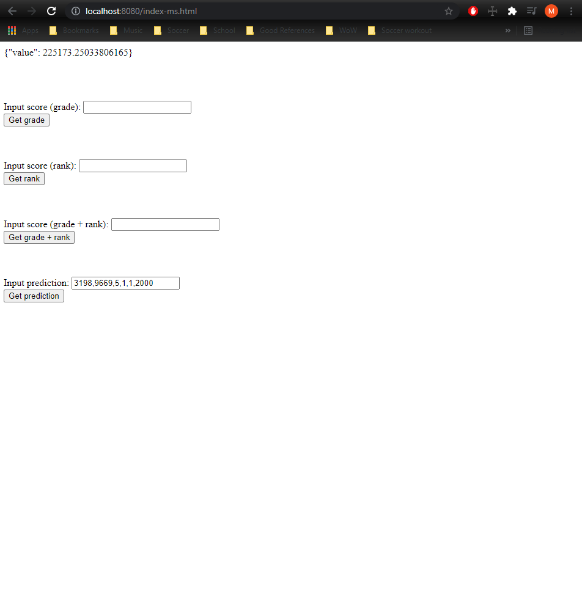
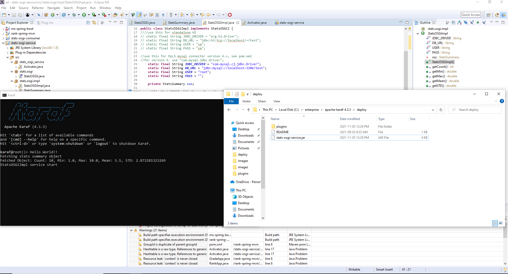
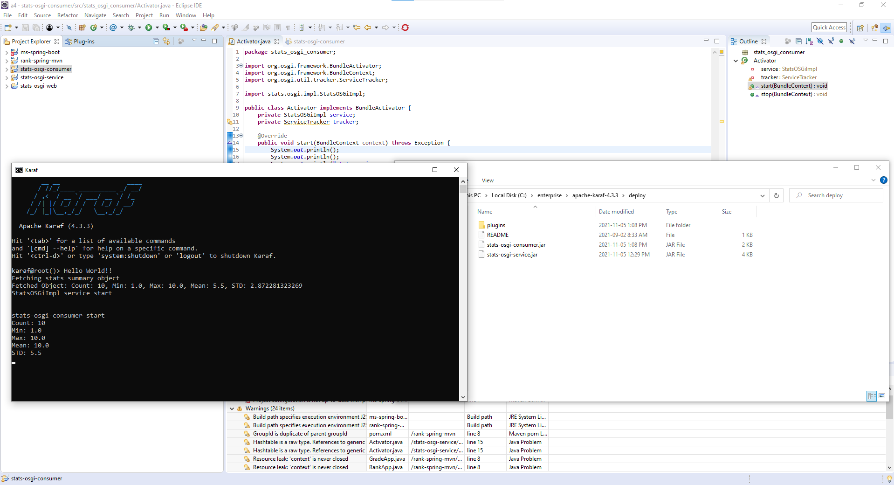
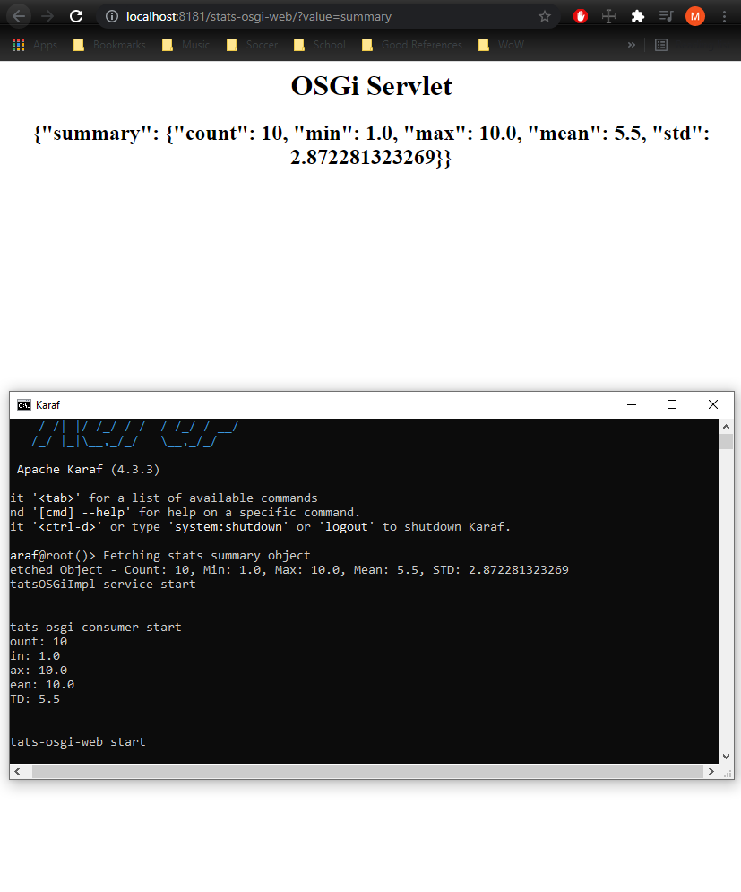

# A4 Report

Author: Mike Sadowski

Date: November 3rd, 2021

Check [readme.txt](readme.txt) for lab work statement and self-evaluation.

Assumptions:

Q2.1: Assuming you wanted to load the stats model from file, as it is done in A1Q3. If the file does not exist, I create a stats model with data `[1,2,3,4,5,6,7,8,9,10]` manually.

## Q1 Spring framework based EC application (programming)

### Q1.1 Grade Spring bean

Complete? yes

{width=90%}

### Q1.2 Rank Spring bean

Complete? yes

{width=90%}

### Q1.3 Rank Spring microservice

Complete? yes

{width=90%}

### Q1.4 Linear regression microservices

Complete? yes

{width=90%}

## Q2 OSGi based EC application (programming)

### Q2.1 stats-osgi-service

Complete? yes

{width=90%}

### Q2.2 stats-osgi-consumer

Complete? yes

{width=90%}

### Q2.3 Web component

Complete? yes

{width=90%}

**References**

1. CP630OC a4
2. `ms-spring-boot\src\main\java\ec\lab\Grade.java` (from example project)
3. `ms-spring-boot\src\main\java\ec\lab\Rank.java` (from example project)
4. https://stackoverflow.com/questions/64810976/is-there-a-way-to-use-binary-search-to-get-a-specific-outcome
