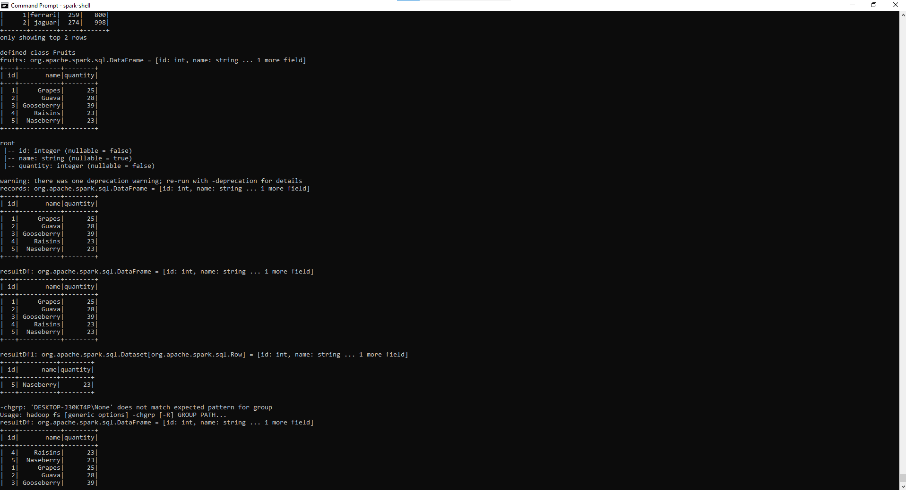
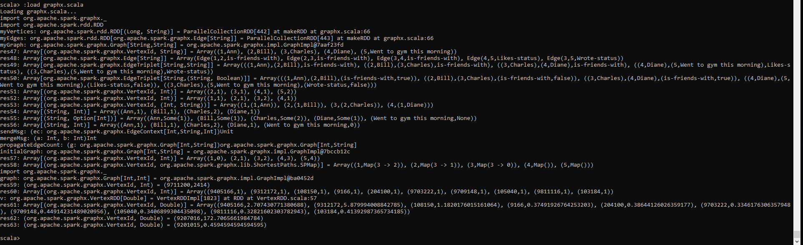

# A5 Report

Author: Mike Sadowski

Date: November 15th, 2021

Check [readme.txt](readme.txt) for lab work statement and self-evaluation.

## Q1 Stats by Hadoop MapReduce (programming)

### Q1.1 HDMR programming for stats

Complete? no

{width=90%}

If No, add a short description to describe the issues encountered.

### Q1.2 HDFS programming for stats

Complete? no

{width=90%}

If No, add a short description to describe the issues encountered.

### Q1.3 EC integration

Complete? no

{width=90%}

If No, add a short description to describe the issues encountered.

## Q2 Spark exploration and EC integration (programming)

### Q2.1 Spark RDD

Complete? yes

{width=90%}

### Q2.2 Spark SQL

Complete? yes

{width=90%}

### Q2.3 Spark Machine Learning

Complete? yes

{width=90%}

### Q2.4 SparkX

Complete? yes

{width=90%}

### Q2.5 Spark model for EC

Complete? no

{width=90%}

If No, add a short description to describe the issues encountered.

## Q3 EC trend

`you can recommend to add and remove one subject or topic to/from the content of this course by writing a short description about the subject and rational. For example, add a subject on git and github, and remove the ANT subject.`

I believe that a lot of the JAVA technologies used in this course are relevant today, I know a lot of companies create internal tools and almost always choose JAVA as the technology base to do them in. However, I feel as though some of the tools we touched do not have a lot of relevance to many enterprise computing applications (although its not a bad thing to know them/about them). For example, GIT is very important to know as it is the glue that holds the development of a project together.

But, if I was to swap in 1 technology to study in this course I would definitely like to see a popular front end frame work such as React/Angular (even maybe Node as well). The reason for this is we studied Hadoop/Spark which are both similar in that they are used for processing large amounts of data. It is good to know and be familiar with 1 of these tools at the least. But I feel swapping the study of 1 out for one of either React/Angular would be beneficial.

This course focused heavily on back end development and data processing and while it touched on SOAP/Restful services, it did not do much in the front end realm. It would be nice to see how the restful API's that we developed are eventually used by front end clients, and show off some of the intricacies and problems that go along with asynchronous programming from the front end (i.e. race conditions).

As well, adding a GIT/GitHub subject would not require the removal of a topic from the course. As I see it, the addition of a GIT component could be easily done while developing some of the other labs/assignments. In the middle of them, you can commit the work to GIT, and at the end as well and show how to change files and make pull requests. Since a lot of the code was re used across assignments, it would be beneficial to create branches off of the assignments and keep working, show merge conflicts and how to handle them as well.

**References**

1. CP630OC a5
2. Add your references if you used.
