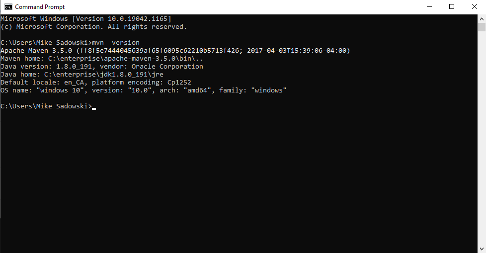
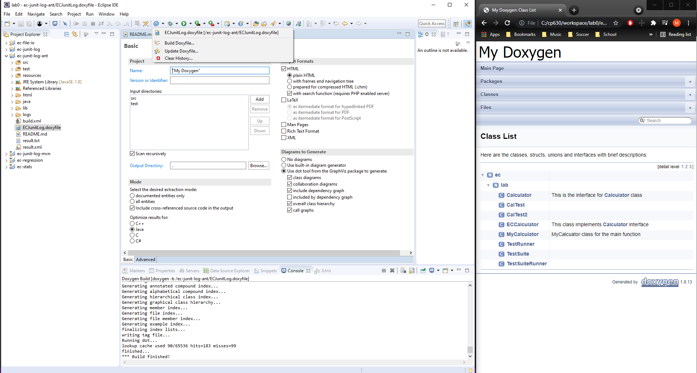

# LAB0 Report

Author: Mike Sadowski

Date: September, 13th 2021

Check [readme.txt](readme.txt) for lab work statement and self-evaluation.

## T1 Java JRE & SDK (lab practice)

### T1.1 Install JRE and JDK

Complete? Yes

{width=90%}

## T2 Build tools (lab practice)

### T2.1 Apache Maven

Complete? Yes

{width=90%}

### T2.2 Apache Ant

Complete? Yes

{width=90%}

### T2.3 Eclipse JEE

Complete? Yes

{width=90%}

## T3 Warm up projects (lab practice)

### T3.1 ec-junit-log

Complete? Yes

{width=90%}

### T3.2 ec-junit-log

Complete? Yes

{width=90%}

### T3.3 ec-junit-log

Complete? Yes

{width=90%}

### T3.4 ec-file-io

Complete? Yes

{width=90%}

Ran file as the read me stated, however got the error shown in the screen shot. A file is missing but read me doesn't state to create or download it.

### T3.5 ec-stats

Complete? Yes

{width=90%}

### T3.6 ec-regression

Complete? Yes

{width=90%}

**References**

1. CP630OC lab0
2. Add your references if you used.
