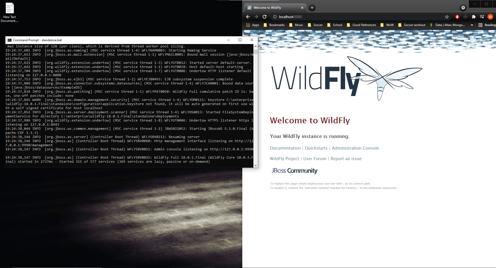
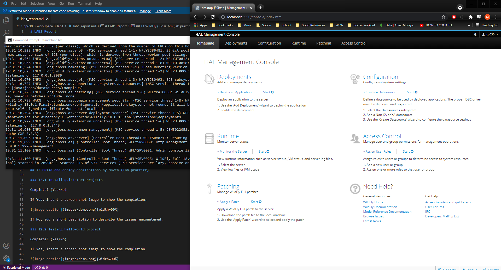
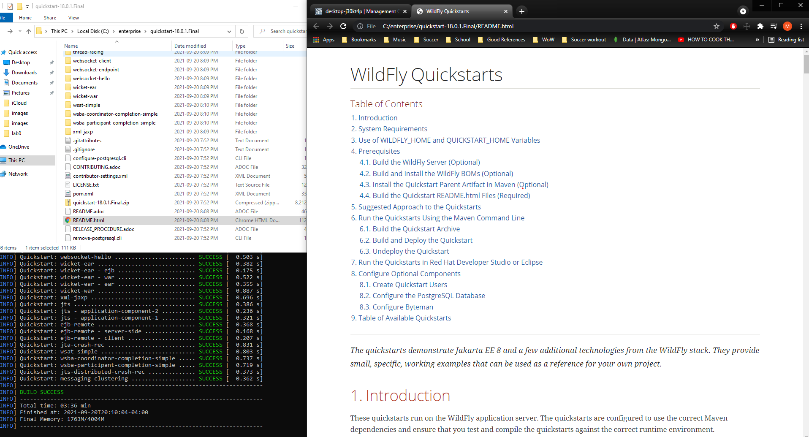
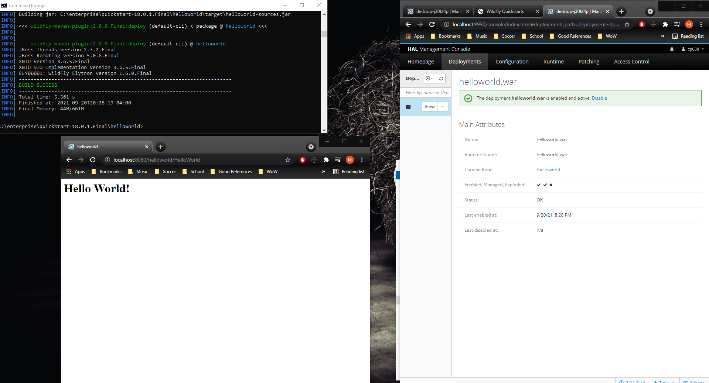
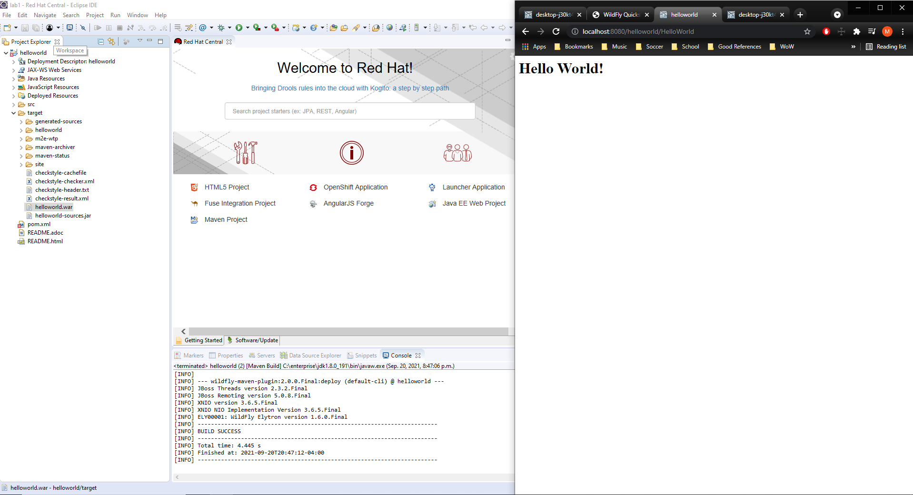
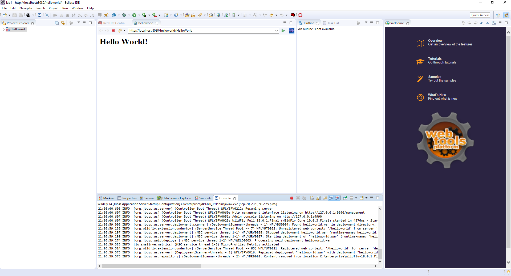
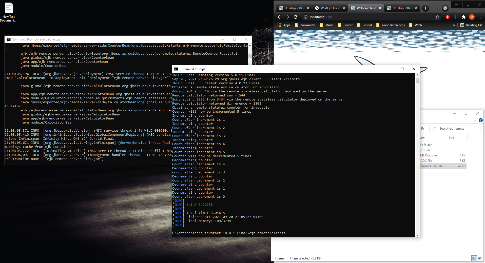
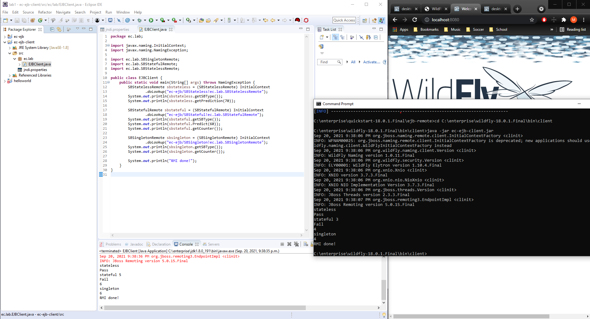
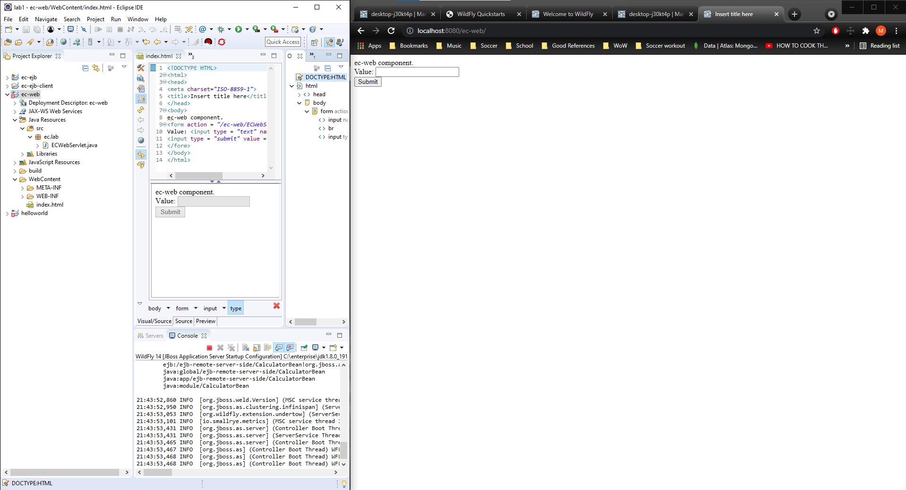
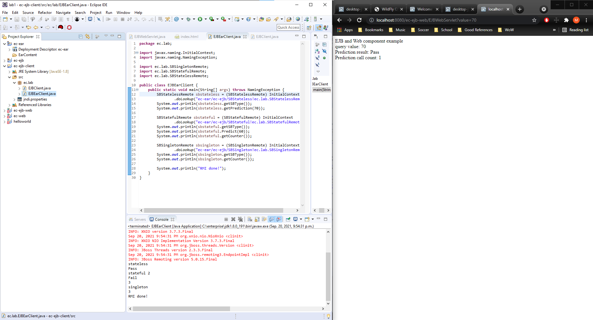

# LAB1 Report

Author: Mike Sadowski

Date: September 20th, 2021

Check [readme.txt](readme.txt) for lab work statement and self-evaluation.

## T1 WildFly (JBoss-AS) (lab practice)

### T1.1 JBoss-AS installation

Complete? Yes

If Yes, insert a screen shot image to show the completion.

{width=90%}

### T1.2 Set admin and user

Complete? yes

If Yes, insert a screen shot image to show the completion.

{width=90%}

## T2 Build and deploy applications by Maven (lab practice)

### T2.1 Install quickstart projects

Complete? yes

If Yes, insert a screen shot image to show the completion.

{width=90%}

### T2.2 Testing helloworld project

Complete? yes

If Yes, insert a screen shot image to show the completion.

{width=90%}

## T3 JBoss-AS Maven on Eclipse JEE (lab practice)

### T3.1 Eclipse Maven and external JBoss

Complete? yes

If Yes, insert a screen shot image to show the completion.

{width=90%}

### T3.2 Run WildFly within Eclipse JEE

Complete? yes

If Yes, insert a screen shot image to show the completion.

{width=90%}

## T4 Hand-on EJB projects (lab practice)

### T4.1 Test ejb-remote project

Complete? yes

{width=90%}

### T4.2 Create EJB components

Complete? yes

If Yes, insert a screen shot image to show the completion.

{width=90%}

### T4.3 Client component

Complete? yes

If Yes, insert a screen shot image to show the completion.

{width=90%}

## T5 Hand-on Web component (lab practice)

### T5.1 Web component of Servlet

Complete? yes

If Yes, insert a screen shot image to show the completion.

{width=90%}

### T5.2 Web components using EJB

Complete? yes

If Yes, insert a screen shot image to show the completion.

{width=90%}

Steps didn't say to deploy this just yet, I screen shotted that I've created both files as described, and no errors are present in the class file.

### T5.3 Application component deployment

Complete? yes

If Yes, insert a screen shot image to show the completion.

{width=90%}

**References**

1. CP630 lab1
2. Add your references if you used.
