# LAB2 Report

Author: Mike Sadowski

Date: October 12th, 2021

Check [readme.txt](readme.txt) for lab work statement and self-evaluation.

## T1 Java Message Service (JSM) (lab practice)

### T1.1 Test run helloworld-jms

Complete? yes

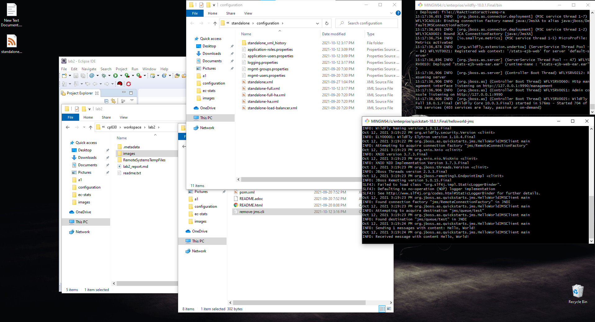{width=90%}

### T1.2 JMS message queue programming

Complete? yes

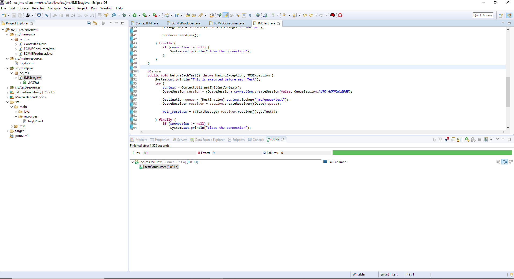{width=90%}

### T1.3 Multiple producers and consumers

Complete? yes

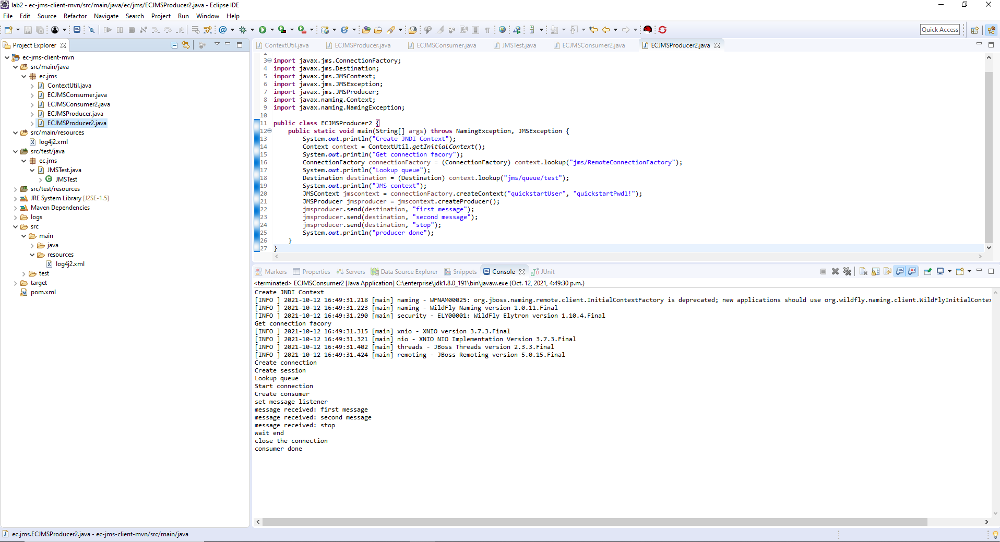{width=90%}

### T1.4 JMS topic programming

Complete? yes

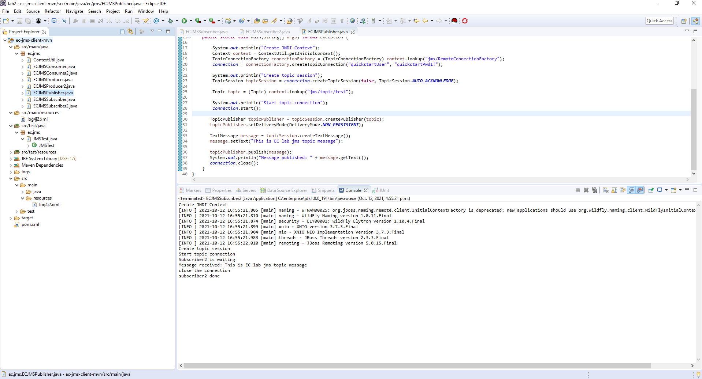{width=90%}

## T2 Message Driven Bean (MDB) (lab practice)

### T2.1 WildFly message within Eclipse

Complete? yes

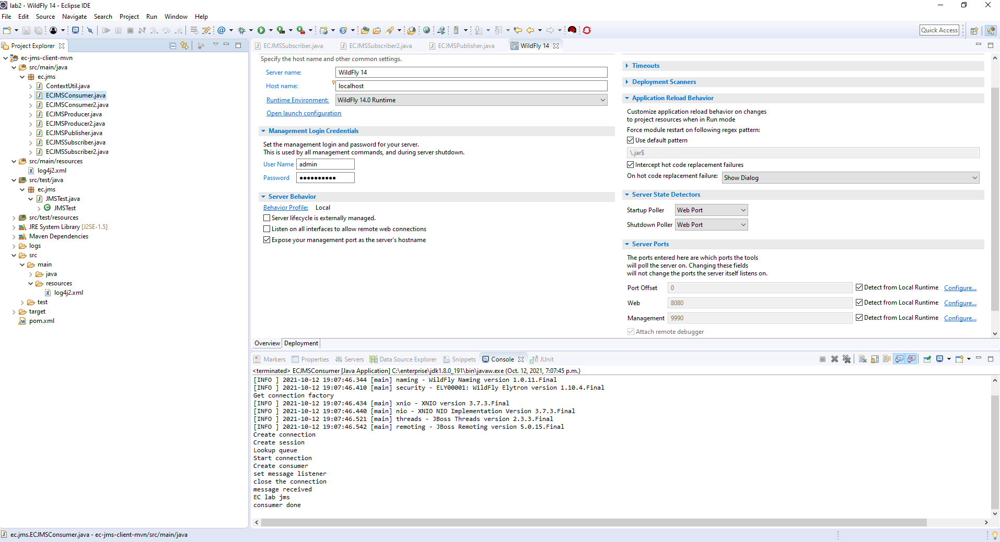{width=90%}

### T2.2 Test helloworld-mdb project

Complete? yes

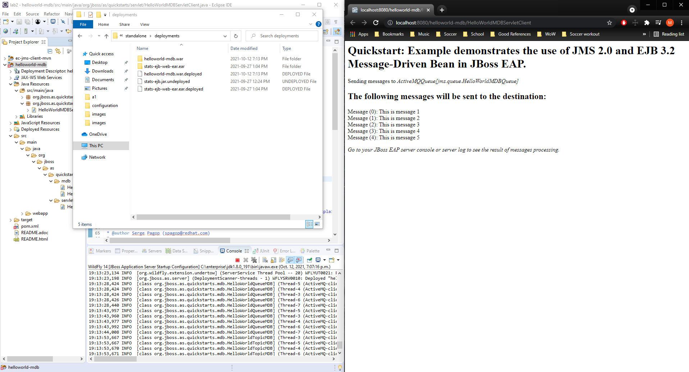{width=90%}

### T2.3 ec-ejb MDB project

Complete? yes

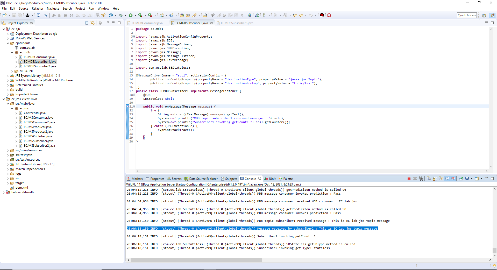{width=90%}

## T3 Database Connection (lab practice)

### T3.1 H2 database

Complete? yes

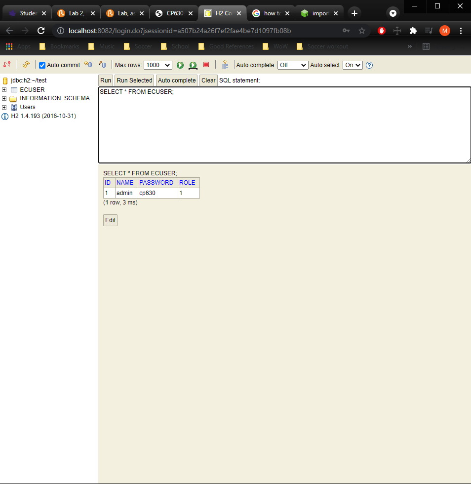{width=90%}

### T3.2 MySQL database

Complete? yes

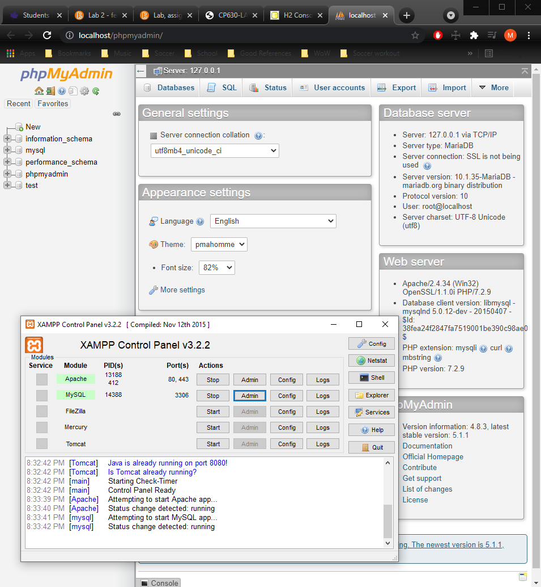{width=90%}

### T3.3 ec-db-client-mvn project

Complete? yes

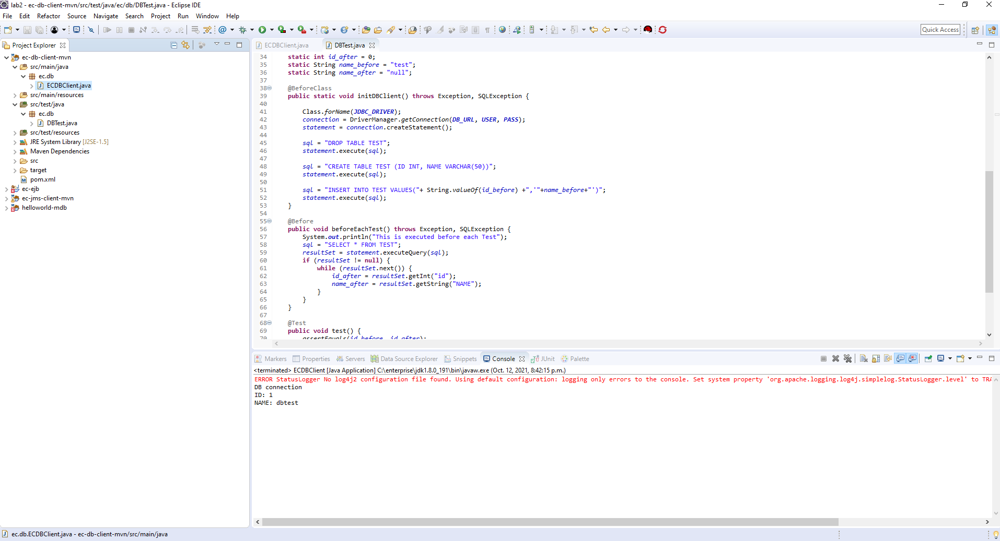{width=90%}
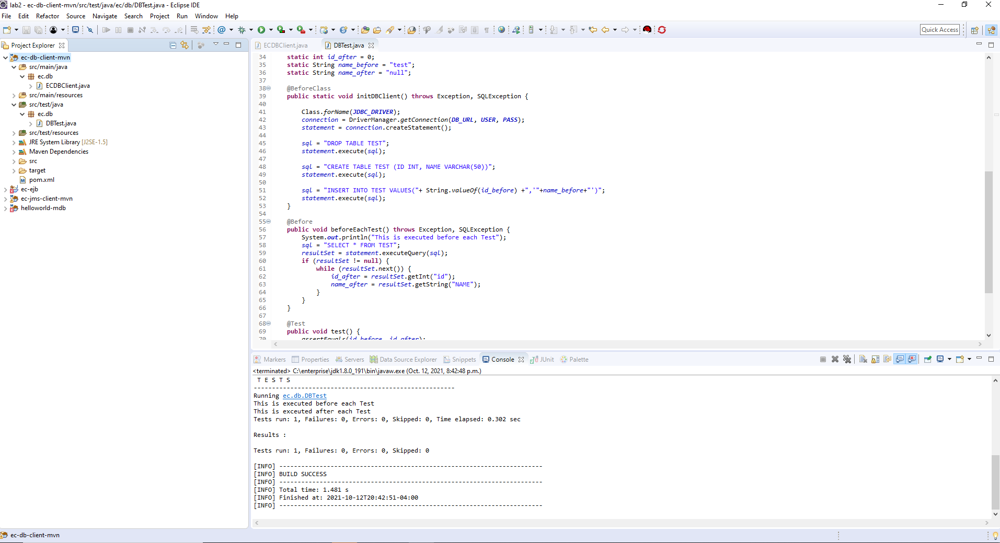{width=90%}

## T4 JPA and Hibernate (lab practice)

### T4.1 Test the JPA example

Complete? yes

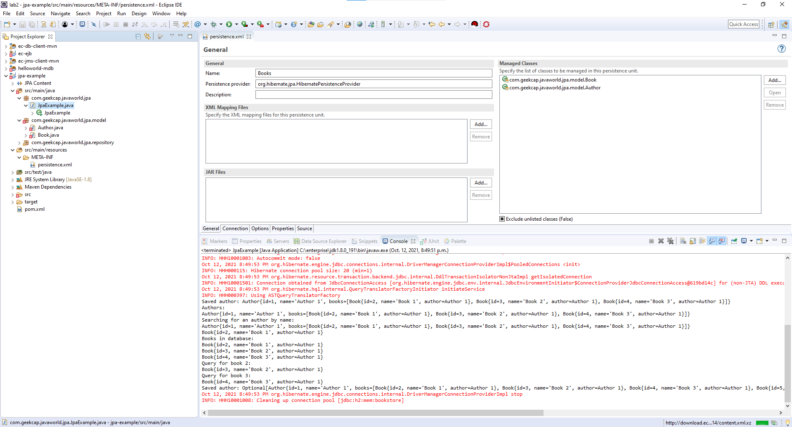{width=90%}

### T4.2 ec-jpa-mvn project

Complete? yes

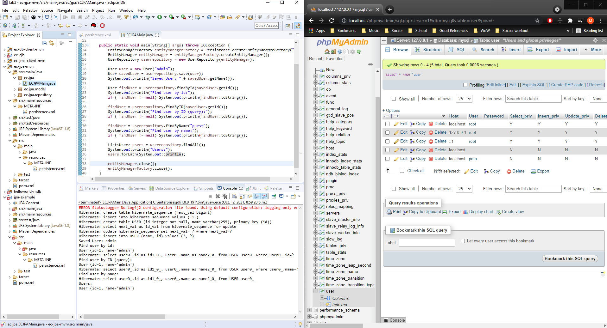{width=90%}

## T5 Entity Beans (lab practice)

### T5.1 Entity Beans with embedded H2

Complete? yes

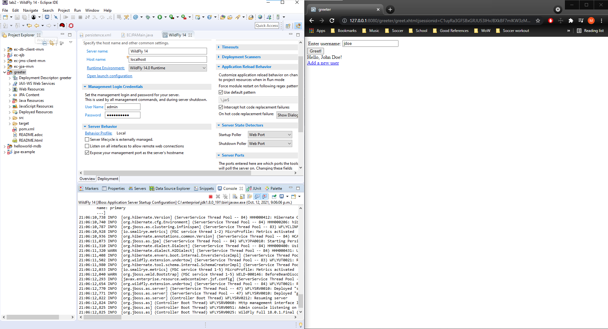{width=90%}

### T5.2 Entity Beans with standalone H2

Complete? yes

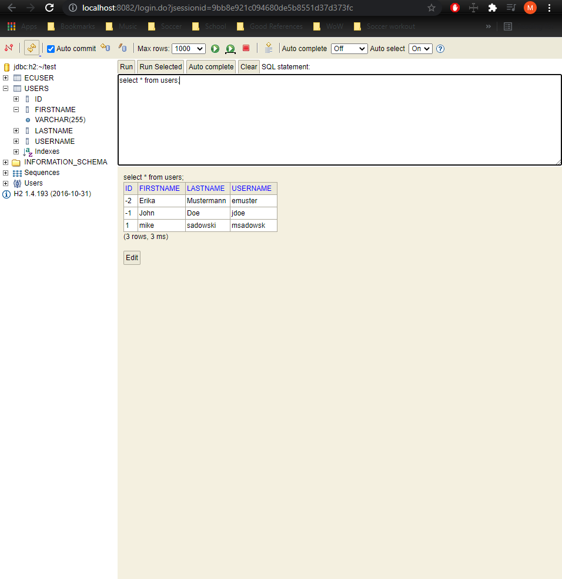{width=90%}

### T5.3 Entity Beans with MySQL

Complete? yes

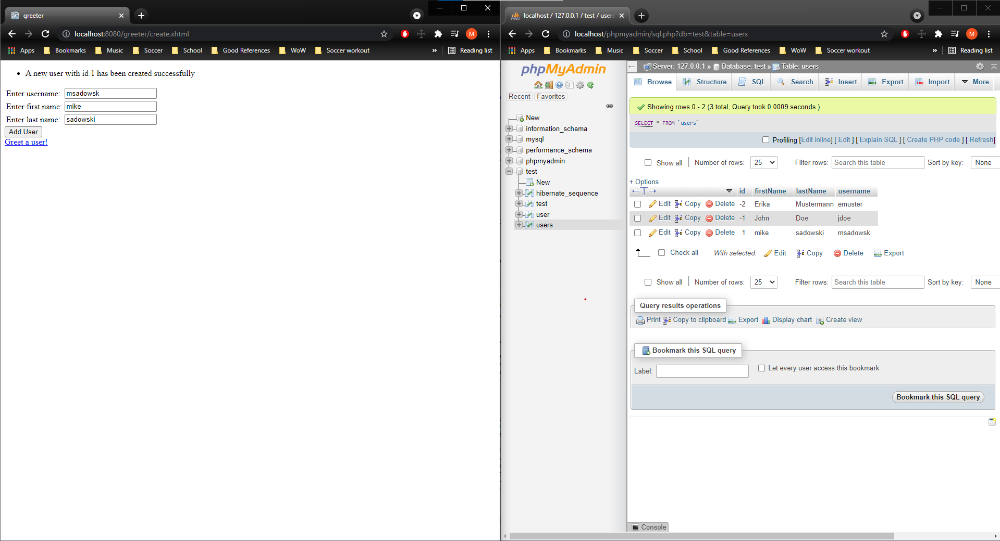{width=90%}

### T5.4 ec-ejb entity project

Complete? yes

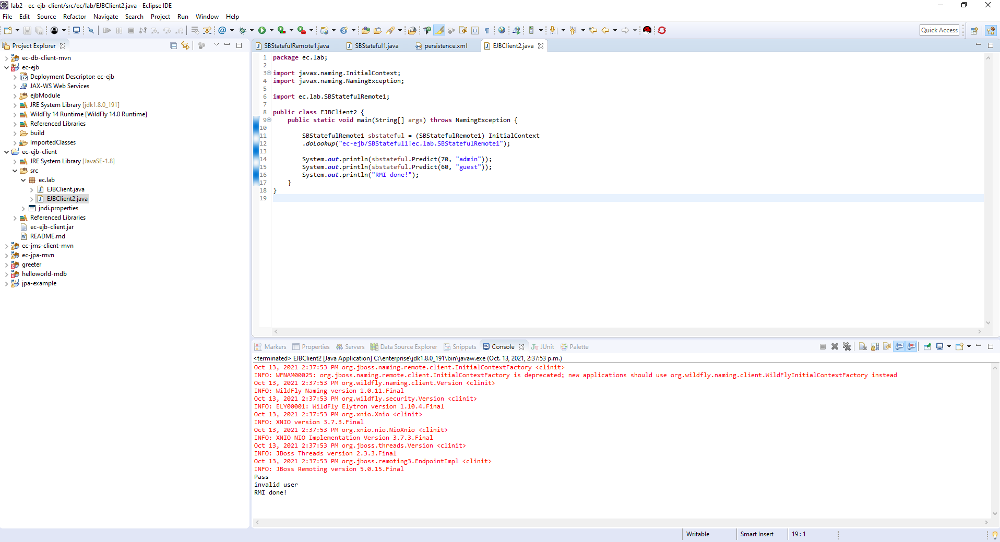{width=90%}

**References**

1. CP630 lab2
2. Add your references if you used.
