# LAB3 Report

Author: Mike Sadowski

Date: October 27th, 2021

Check [readme.txt](readme.txt) for lab work statement and self-evaluation.

## T1 SOAP Web Services (lab practice)

### T1.1 Red Hat Developer Studio

Complete? yes

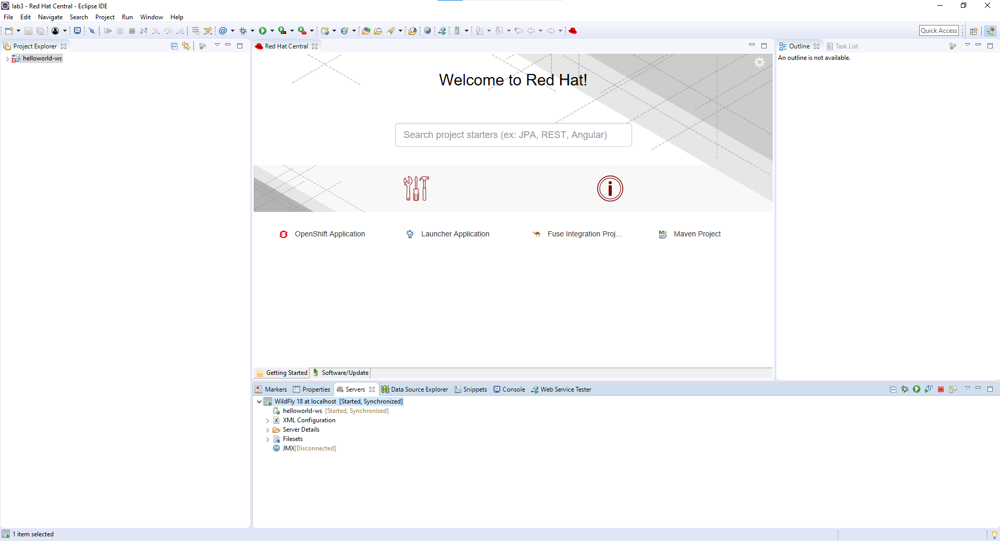{width=90%}

### T1.2 Quickstart helloworld-ws

Complete? yes

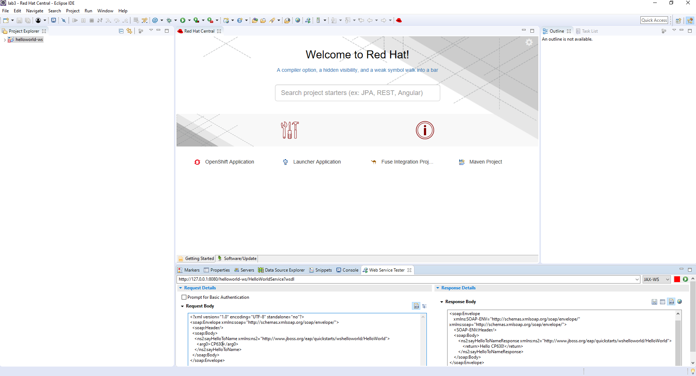{width=90%}

### T1.3 SOAP WS ec-ws project

Complete? yes

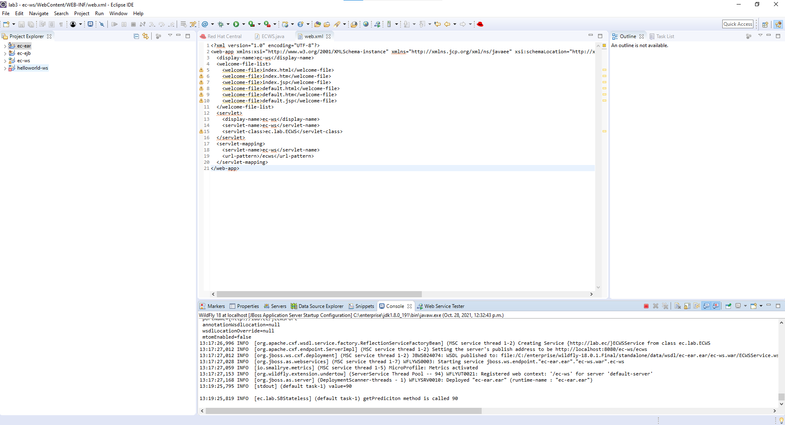{width=90%}

### T1.4 WS ec-ws-client project

Complete? yes

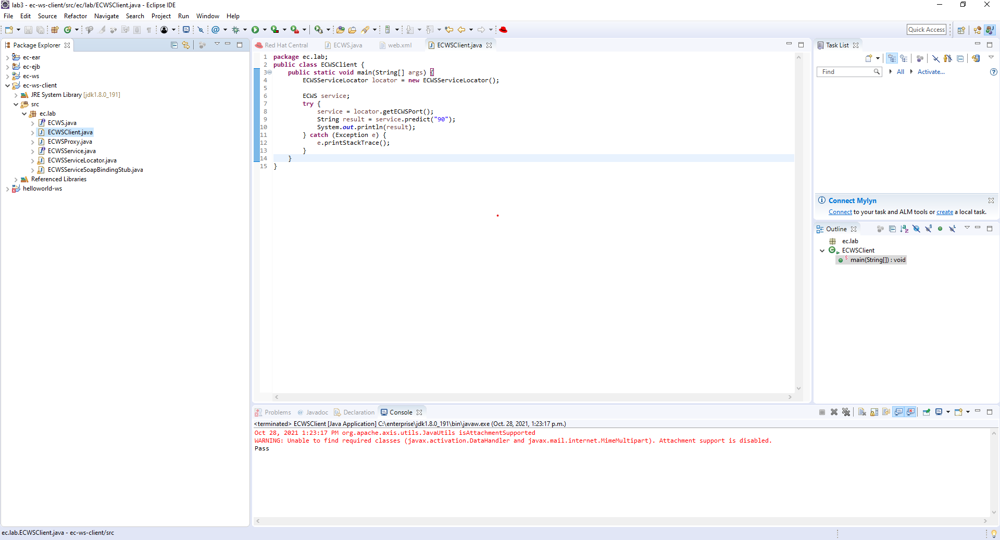{width=90%}

### T1.5 Web service with interfaces

Complete? yes

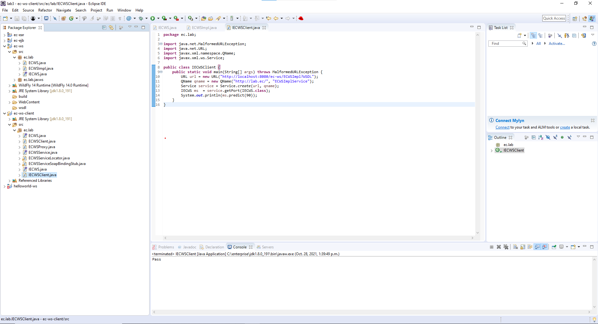{width=90%}

### T1.6 Access WS by Servlet

Complete? yes

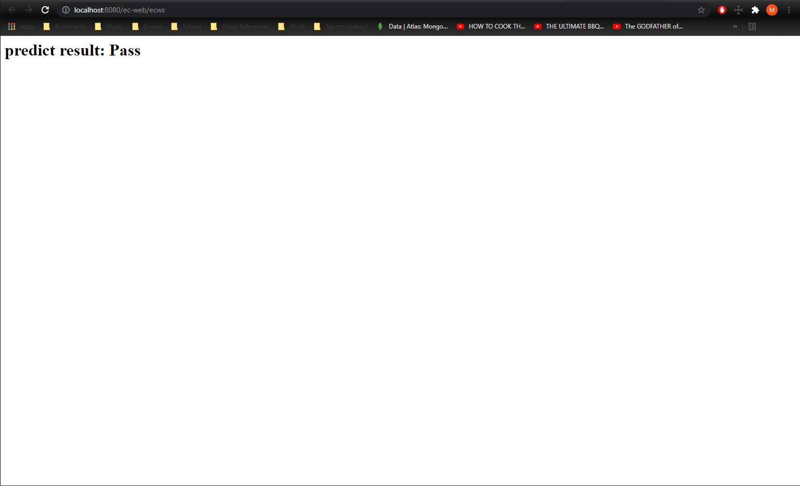{width=90%}

## T2 RESTful Web Services (lab practice)

### T2.1 Quickstart helloworld-rs

Complete? (Yes/No)

If Yes, insert a screen shot image to show the completion.

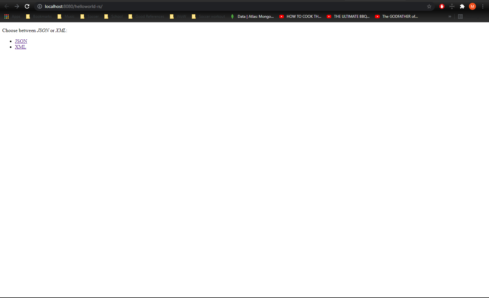{width=90%}

If No, add a short description to describe the issues encountered.

### T2.2 RESTful WS project ec-rs

Complete? yes

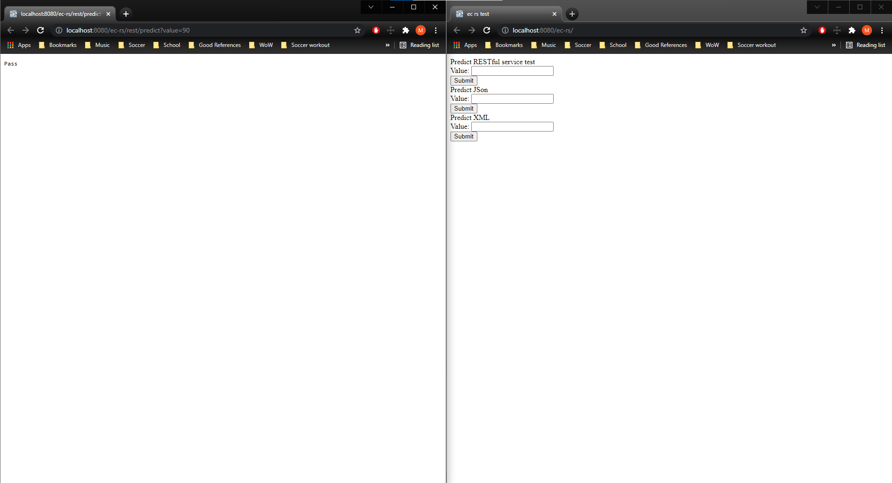{width=90%}

## T3 Web tier - Servlet, JSP, JSF (lab practice)

### T3.1 Servlet API programming

Complete? yes

{width=90%}

### T3.2 Simple login example

Complete? yes

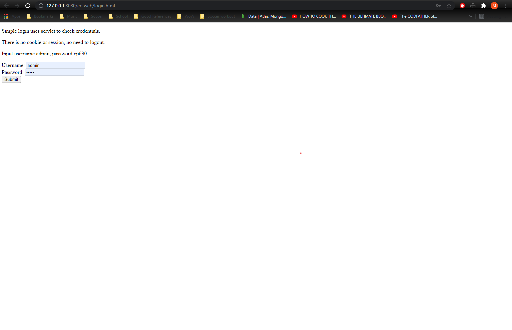{width=90%}

### T3.3 Hand on JSP

Complete? yes

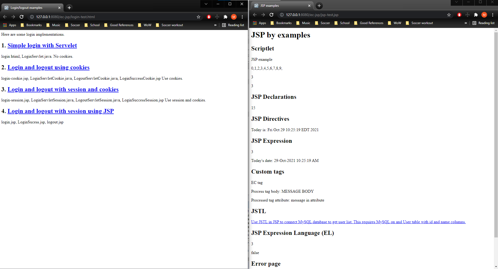{width=90%}

### T3.4 Hand on JSF

Complete? yes

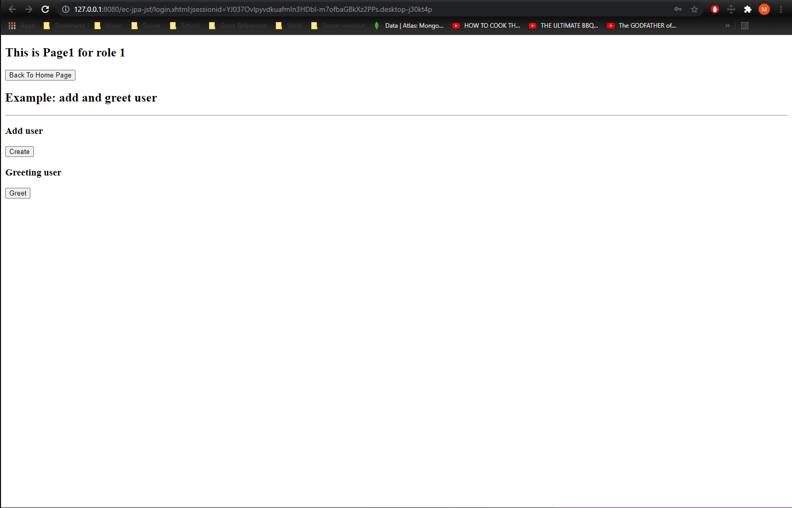{width=90%}

## T4 Client tier components (lab practice)

### T4.1 Java HTTP client project

Complete? yes

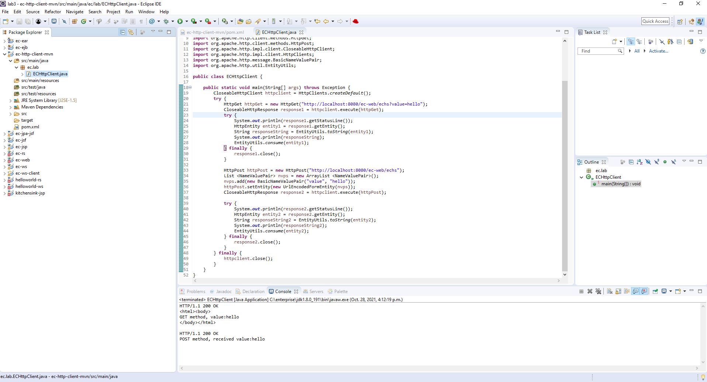{width=90%}

### T4.2 JavaScript & jQuery components

Complete? yes

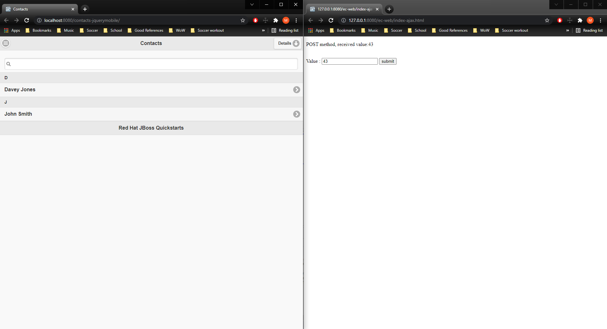{width=90%}

### T4.3 JavaScript & React components

Complete? yes

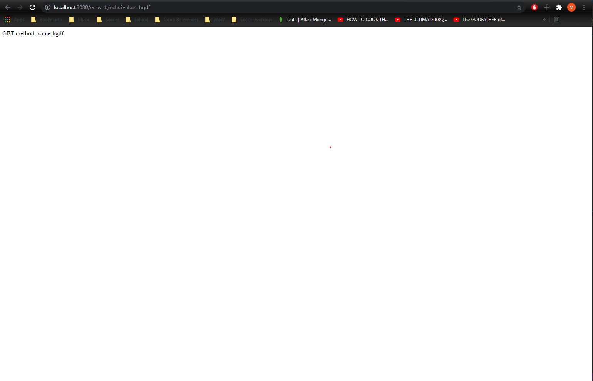{width=90%}

**References**

1. CP630 lab3
2. Add your references if you used.
