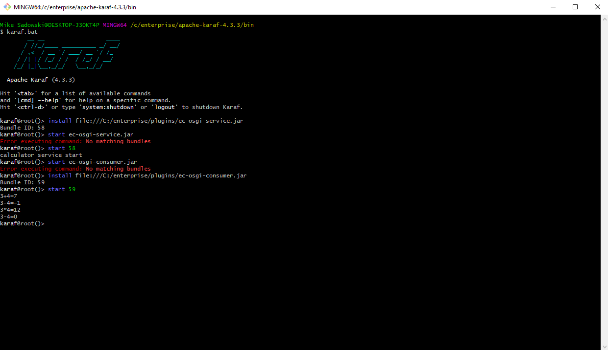

# LAB4 Report

Author: Mike Sadowski

Date: November 2nd, 2021

Check [readme.txt](readme.txt) for lab work statement and self-evaluation.

## T1 Spring Framework (lab practice)

### T1.1 Hand on IoC

Complete? yes

{width=90%}

### T1.2 Hand on AOP

Complete? yes

{width=90%}

### T1.3 Web component of Spring MVC

Complete? yes

{width=90%}

### T1.4 Spring Boot Web applications

Complete? yes

{width=90%}

### T1.5 Spring on WildFly

Complete? yes

{width=90%}

## T2 OSGi Framework (lab practice)

### T2.1 Equinox OSGi framework

Complete? yes

{width=90%}

### T2.2 Create OSGi bundles in Eclipse

Complete? yes

{width=90%}

### T2.3 Apache Felix OSGi framework

Complete? yes

{width=90%}

### T2.4 Apache Karaf

Complete? yes

{width=90%}

## T3 OSGi Service Bundle development (lab practice)

### T3.1 OSGi service bundle

Complete? yes

{width=90%}

If No, add a short description to describe the issues encountered.

### T3.2 ec-osgi-consumer bundle

Complete? yes

{width=90%}

### T3.3 Web application bundles

Complete? yes

{width=90%}

### T3.4 Servlet bundles

Complete? yes

{width=90%}

## T4 Docker (lab practice)

### T4.1 Install Docker and operations

Complete? yes

{width=90%}

### T4.2 Creating docker images

Complete? yes

{width=90%}

If No, add a short description to describe the issues encountered.

## T5 Container orchestration (lab practice)

### T5.1 Install and run Microk8s

Complete? yes

{width=90%}

### T5.2 Basic operations on Microk8s

Complete? yes

{width=90%}

**References**

1. CP630 lab4
2. Add your references if you used.
