# LAB5 Report

Author: Mike Sadowski

Date: November 5th, 2021

Check [readme.txt](readme.txt) for lab work statement and self-evaluation.

## T1 Apache Cassandra (lab practice)

### T1.1 Install, configure, and run

Complete? yes

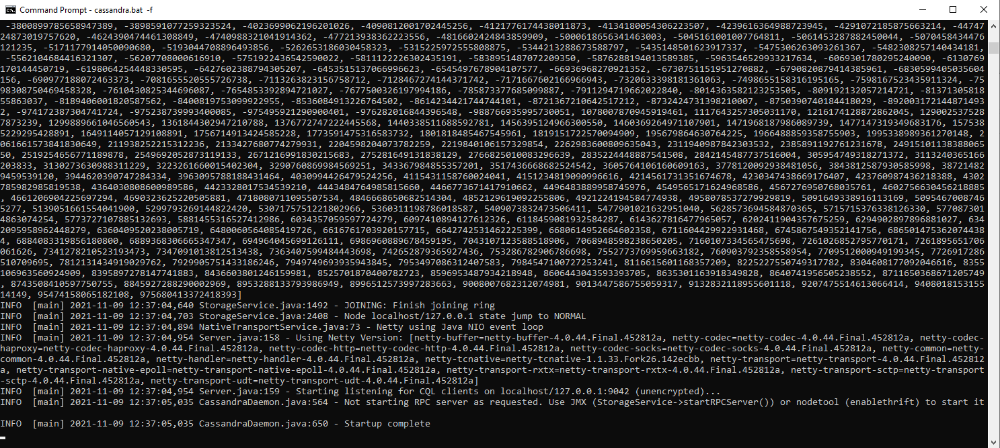{width=90%}

### T1.2 CQL operations by cqlsh

Complete? yes

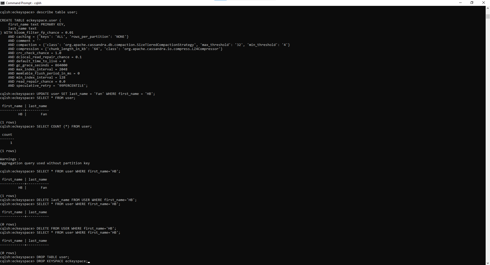{width=90%}

### T1.3 CQL programming by Java API

Complete? yes

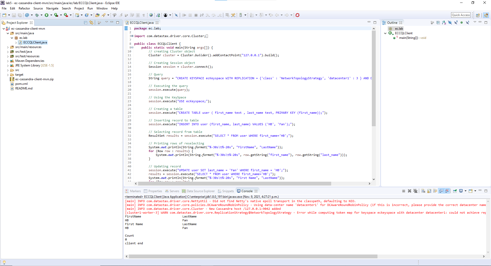{width=90%}

## T2 Apache Hadoop and HDFS (lab practice)

### T2.1 Install, configure, and start

Complete? yes

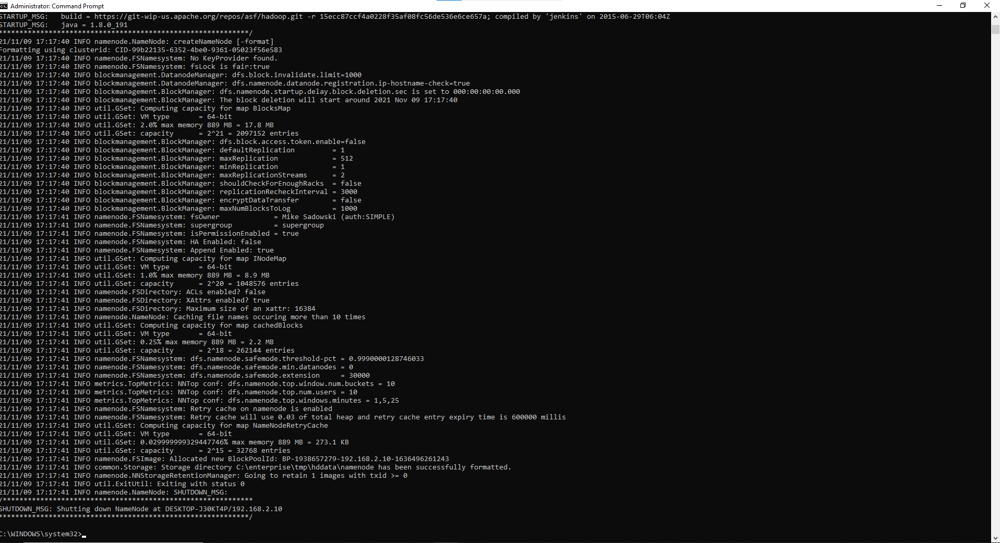{width=90%}

### T2.2 HDFS CLI operations

Complete? yes

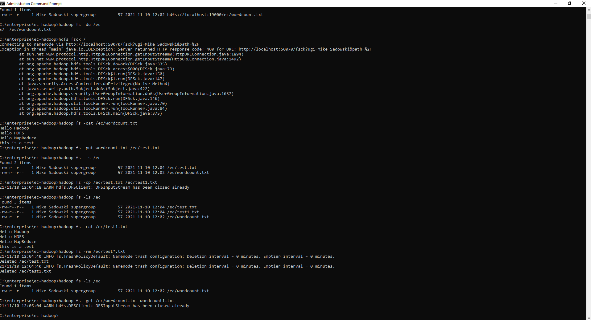{width=90%}

## T3 Hadoop MapReduce (lab practice)

### T3.1 Word counter example

Complete? yes

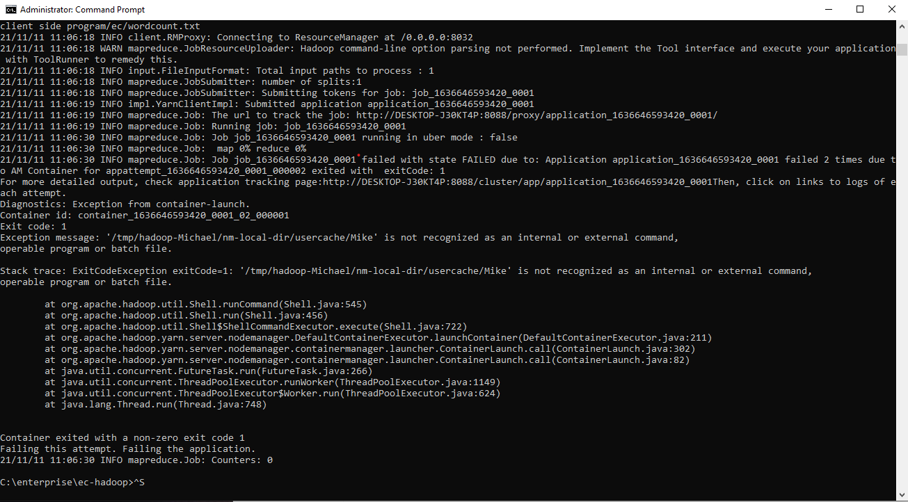{width=90%}

I believe the error shown above is a result of my windows account having a space in it (Mike Sadowski). I tried changing the account name, making a new windows account (doesn't work as it seems its caching that old username somewhere in the setup files, which I have tried to clear but to no avail), searching online and trying to edit the cross-site.xml file. Spent 2 days on this and its not working, handing it in as is. The rest of the setup was done correctly so this would work if it wasn't for this weird error.

### T3.2 Kmeans by Hadoop MapReduce

Complete? yes

{width=90%}

Similar to above, I believe the error shown above is a result of my windows account having a space in it (Mike Sadowski). I tried changing the account name, making a new windows account (doesn't work as it seems its caching that old username somewhere in the setup files, which I have tried to clear but to no avail), searching online and trying to edit the cross-site.xml file. Spent 2 days on this and its not working, handing it in as is. The rest of the setup was done correctly so this would work if it wasn't for this weird error.

### T3.3 Hadoop client programming

Complete? yes

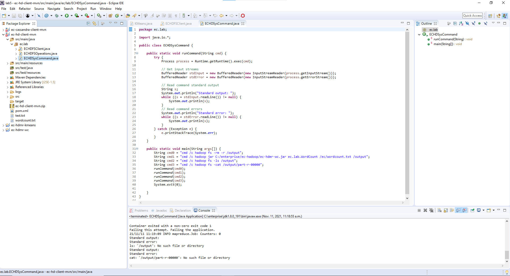{width=90%}

## T4 Apache Spark (lab practice)

### T4.1 Install, configuration, start

Complete? yes

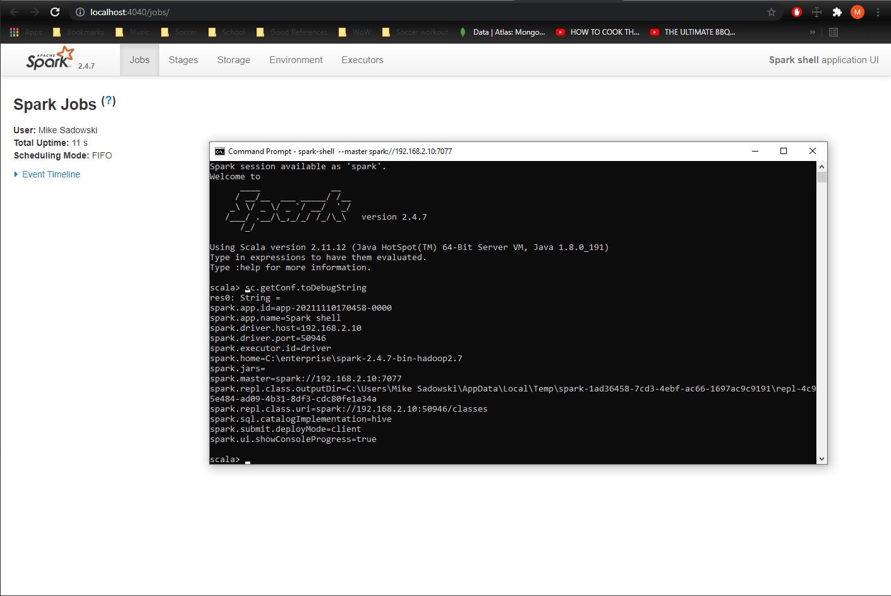{width=90%}

### T4.2 Spark operations in Scala shell

Complete? yes

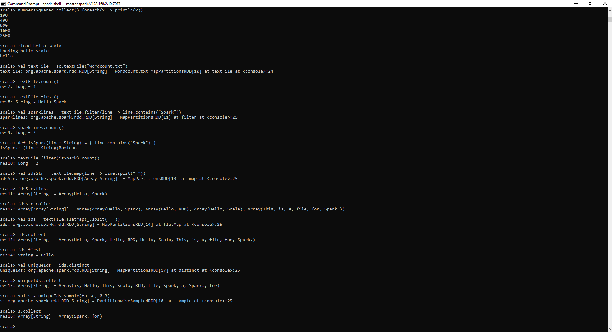{width=90%}

### T4.3 MapReduce with Spark

Complete? yes

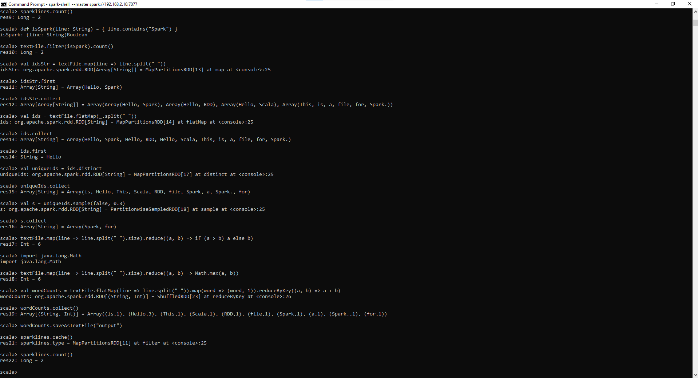{width=90%}

## T5 Spark Programming (lab practice)

### T5.1 Spark programming in Java

Complete? yes

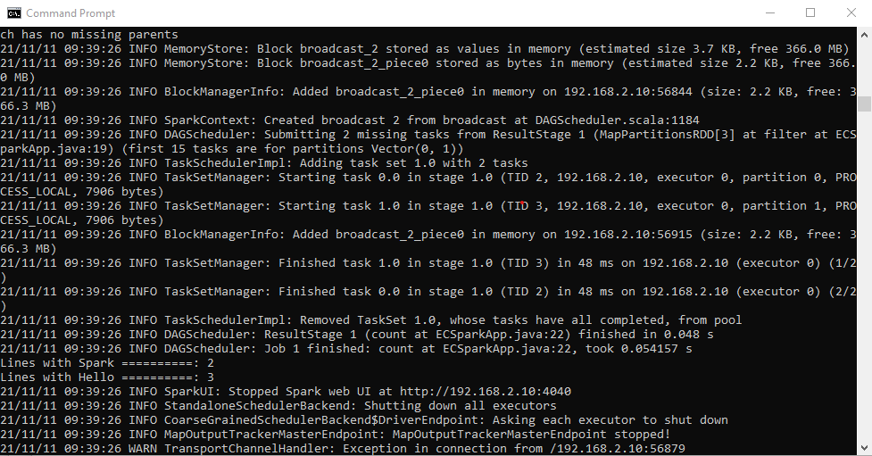{width=90%}

**References**

1. CP630 lab5
2. Add your references if you used.
