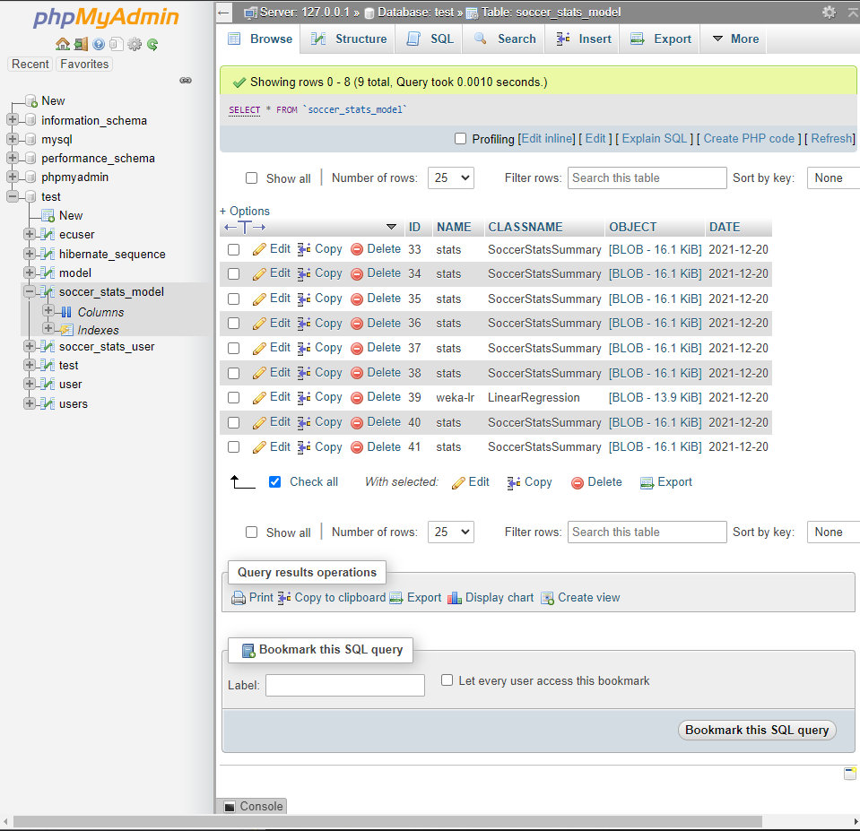
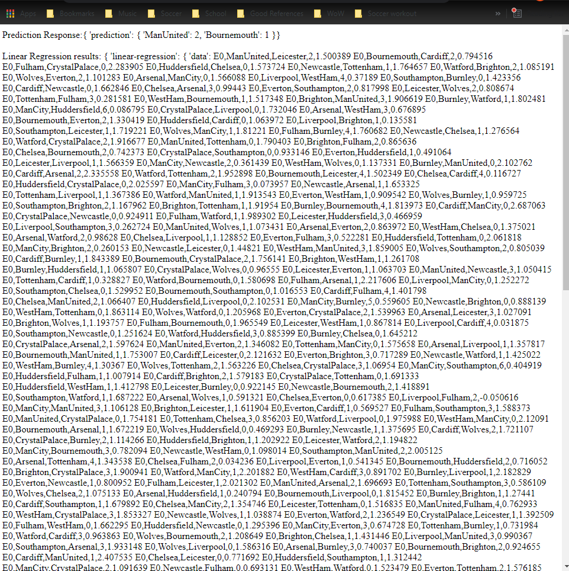
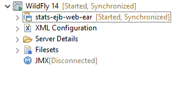

# PROJECT Report

Author: Mike Sadowski

Date: December 5th, 2021

Check [readme.txt](readme.txt) for lab work statement and self-evaluation.

		Setup
		1. Start MySql/Apache via XAMPP Control Panel
		2. 'stats-db-client-mvn', run StatsDBClient.java as Java Application (creates tables in MySql)
		3. Open CMD terminal to 'lr-weka-mvn' of this project. Run 'java -jar WekaRegressionModel.jar -i 2018-2019.arff -o weka_regression.bin' (train the model and create file weka_regression.bin)
		4. Copy 'data' folder from project root to 'C:\enterprise\wildfly-18.0.1.Final\bin\'
		5. 'lr-weka-mvn', run ModelInsert.java as Java Application (inserts linear regression data into DB)
		6. Deploy 'stats-ejb-web-ear' to WildFly

		Usage
		(http://localhost:8080/stats-ejb-web/login.html)
		1. Select Home team + Away team to see future match outcome result between these 2 teams
		2. If no score is present for those teams (error in data file), appropriate error message will be displayed
		3. (Admin only) Data input #1: Select input file used for analysis (only 1 available for now)
		4. (Admin only) Data input #2: Input data manually (ensure correctness, e.g. 10/8/18, Man United, Arsenal, 1, 4)

		Readme
		1. Admin User:  username=user1, password=password
		2. Standard User:  username=user2, password=password
		3. No input validation is present, input correct data at all times
		4. Must load data into DB before trying to retrieve stats

## Project Requirements (project)

### R1 Write a project proposal (2-3 pages).

Complete? yes

Check `project/proposal/proposal_template.html` file for project proposal

### R2 Design data format, collect data, create dataset for the application.

Complete? yes

If Yes, briefly describe:

I used the website `https://data.world/` and retrieved 2 csv files that contain data for all the premier league match results from 2016-2017, 2018-2019 seasons.

I created the data set I will be using by parsing the file using Java functions, and parsed the data I wanted to use (division, data, home team, away team, home team goals, away teams goals).

The data is located in the `project/data/` directory as `2016-2017.arff` and `2018-2019.arff`

### R3 Develop and implement data application algorithms for the proposed application problem.

Complete? yes

If Yes, briefly describe:

I used WEKA API to classify data models from the datasets. Then using the data between 2 inputted teams (e.g. Arsenal vs ManUnited), I calculate a simple linear regression to product a prediction of the result of a future match between these 2 teams. More data would more accurately predict the result, but for simplicity I have only used the 2 seasons listed above.

### R4 Do data computing to generate models, representing models in portable format and stored in file or database. More credit is given if distributed approach is used data mining of big dataset.

Complete? yes

If Yes, briefly describe:

Using WEKA API, I classified the data models from the data set. The data is then stored in the MySQL database for portability and ease of access (See screenshot).

{width=90%}

### R5 Create deployable service components using application models using Java based enterprise computing technologies, to create client program to do remote call of the data mining services.

Complete? yes

Used a service to provide information to the front end of the application. Calls are made via HTTP to the backend though servlets. Data is stored in MySQL and shown as requested to the user on the front end.

{width=90%}

### R6 Deploy service components onto enterprise application servers.

Complete? yes

Web servers are deployed onto WildFly 18

{width=90%}

### R7 Create web services (SOAP, RESTful) to use the data service components.

{width=90%}

### R8 Create web user interface/mobile applications to use the application/web services.

Complete? yes

{width=90%}

### R9 Test your services, log your services, and document your term project.

Complete? yes

If Yes, briefly describe:

Manual testing performed, see screenshot. Various logging throughout app (such as saving to DB). See powerpoint file for documentation.

{width=90%}

### R10 Demonstrate your term project in final project presentation, slides, short video.

Complete? yes

If Yes, briefly describe:

See powerpoint file for documentation

**References**

1. CP630OC project
2. Add your references if you used.
